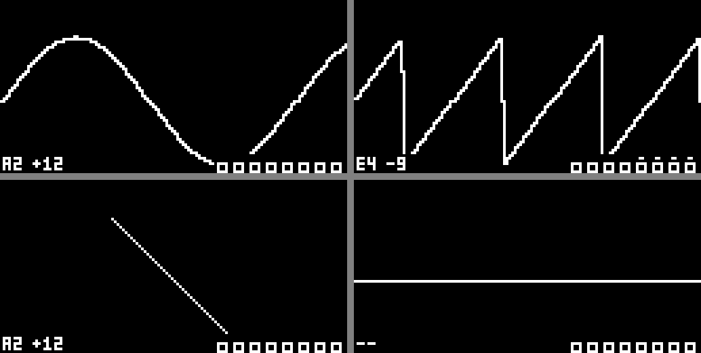

# DT1_8_POLY_OSC

Unofficial, community-made patch set for the 8-track MK1 sampler groovebox ("DT1"), based on **OS 1.53**.
**POLY** (8-voice polyphony across the audio tracks) is the core. The "..." (three dots) key gets a
**utility page** that you choose when building: **Scope** or **Spectrum**. Both include a tuner and track activity.

> **Unofficial and unsupported. Not affiliated with, endorsed by or supported by the hardware's manufacturer.
> Flashing modified firmware is at your own risk.** Read [DISCLAIMER.md](DISCLAIMER.md) and [RISKS.md](RISKS.md) first.



## Builds

| page on the "..." key | release | unit shows | hardware |
|---|---|---|---|
| Scope (waveform) | v3p | 1.5b | not yet tested (v3n / 1.5Z confirmed) |
| Spectrum | v3q-spectrum | 1.5c | not yet tested |

## Features

**POLY** - a 5th sample machine in the FUNC+SRC list
- Tracks set to POLY share one voice pool; the lowest POLY track is the *control* track (its sound is used).
- Sequencer trigs on the control track rotate across the POLY tracks.
- *MIDI cable*: notes and chords from a MIDI track (e.g. recorded from an external sequencer) play the POLY
  tracks whose MIDI receive channel equals the MIDI track's output channel - free voice first, else oldest.
- CCs from that MIDI track reach the POLY tracks (filter/amp sequencing); SRC TUNE and LFOs stay per voice.
- POLY survives kit/project reload.

**Utility page** - opens with the "..." (three dots) key; one per build: `--page scope` or `--page spectrum`
- *Scope*: live waveform. *Spectrum*: 30 Hz..20 kHz analyser (128 log columns, 60 dB, falling peaks;
  bass from a 170 ms window, highs from a 21 ms window).
- Both pages:
  - main view -> X-Y (stereo goniometer) -> close, with the same key. **YES** = fullscreen, **NO** = close.
  - bottom-right: activity boxes for all 8 audio tracks (flash on trig; POLY voices stay lit while held).
  - bottom-left: **tuner** (note + cents, ~12 Hz..3 kHz).
  - the top bar (pattern, name, tempo), mutes, pattern/bank change, page keys and **knobs** all keep working
    while the page is open, so you can tweak a sound and watch it change.

**Song mode** is disabled (its code space is reused). Chains still work.

Full controls: [docs/USAGE.md](docs/USAGE.md). Version history: [CHANGELOG.md](CHANGELOG.md).

## Getting it

- **Prebuilt image**: see the repository's *Releases* (private). Check the SHA-256 before flashing.
- **Build it yourself** from your own copy of the official OS 1.53 file (recommended; identical result):

```sh
# get the MIT-licensed .syx container tool by mischa85 (GitHub) and build it with `make`, then:
python3 tools/build.py --official <official OS 1.53 .syx> --tool <path to the container tool> --page scope
# -> out/DT1_8_POLY_OSC_v3p_1.5b.syx            SHA-256 f8cd0d721c265a07077078a5aae95908c265ce3fadd0c83cbbb377916b51b8b3
python3 tools/build.py --official <official OS 1.53 .syx> --tool <path to the container tool> --page spectrum
# -> out/DT1_8_POLY_OSC_v3q-spectrum_1.5c.syx   SHA-256 3aeb2bb8c4a79c7a807d4ee62336ba8e045078d6ae3d122d64e53a0c8851564a
```

The build refuses any input that is not the exact official OS 1.53 file and checks every patched byte.
Flashing and **reverting**: [docs/INSTALL.md](docs/INSTALL.md).

## Repository layout

| path | contents |
|---|---|
| `src/` | assembly for every hook (ColdFire, GNU as `-mcpu=5475`) |
| `bin/` | the assembled hooks (committed; `make` rebuilds them) |
| `tools/build.py` | official .syx -> patched .syx, fully verified |
| `tools/patch_section3.py` | applies all patches to the MAIN OS section |
| `tests/` | emulator tests: the real firmware code runs under unicorn with the patches (`tests/run_tests.sh <official s3> <patched s3> scope|spectrum`) |
| `docs/` | install/revert, usage, technical notes (reverse-engineering log) |

No firmware from the manufacturer is stored in this repository. Released `.syx` images are attached to
Releases only; see [DISCLAIMER.md](DISCLAIMER.md).

## License

Our own code and docs: MIT ([LICENSE](LICENSE)). This does **not** cover the manufacturer's firmware.
